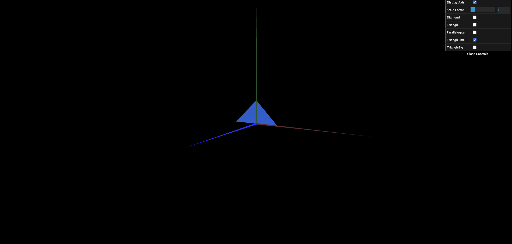
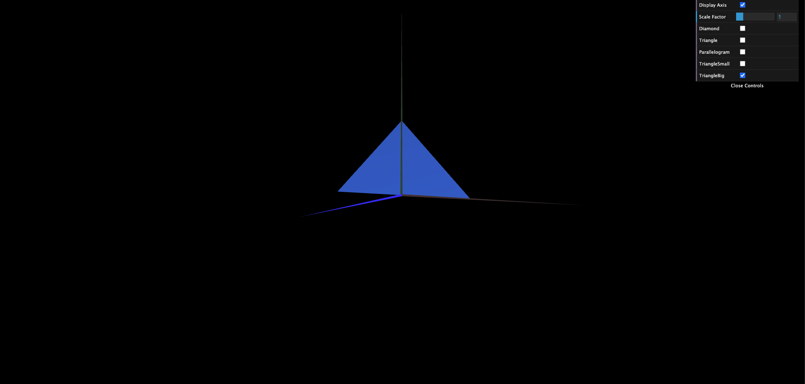

# CG 2023/2024

## Group T05G05

## TP 1 Notes

- In exercise 1 we built **MyTriangle**, **MyParallelogram** and **MyDiamond**. To create the checkbox controllers that control the visibility of each figure we followed the display axis checkbox implementation. The major difficulty was understanding the indices, so that the parallelogram could be *double-sided*.
- In exercise 2 we built MyTriangleSmall and MyTriangleBig using the knowledge acquired from the previous exercise.

Exercise 2 - **MyTriangleSmall**

Exercise 2 - **MyTriangleBig**

