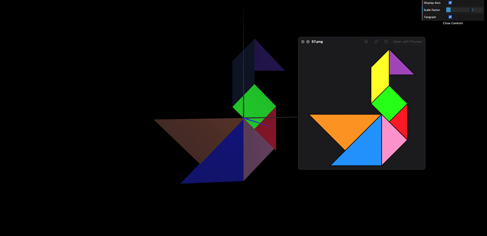
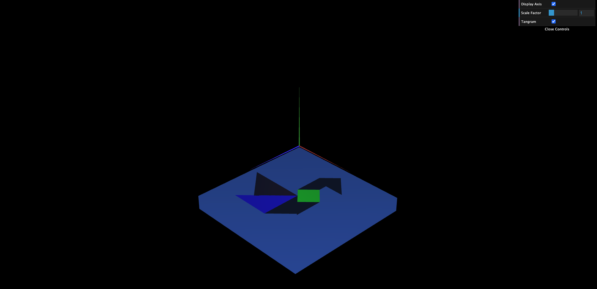
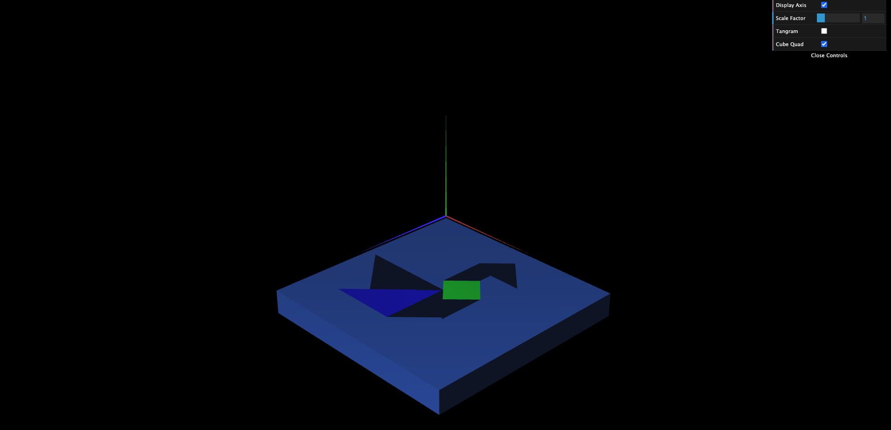

# CG 2023/2024

## Group T05G05

## TP 2 Notes

- 
- 

### Exercise 2 - WebCGF functions for geometric transformations

**MyTangram**

### Exercise 3 - Three-dimensional geometry - Unit Cube

**MyUnitCube**

### Exercise 4 - Composite Geometry - Cube composed of Planes

**MyUnitCube**

