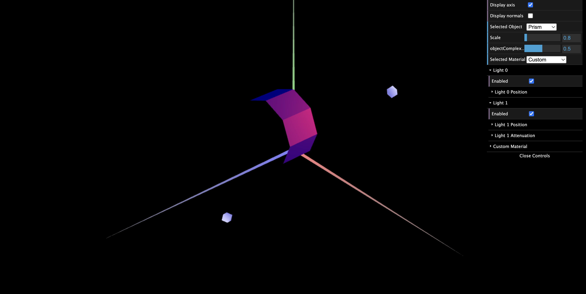
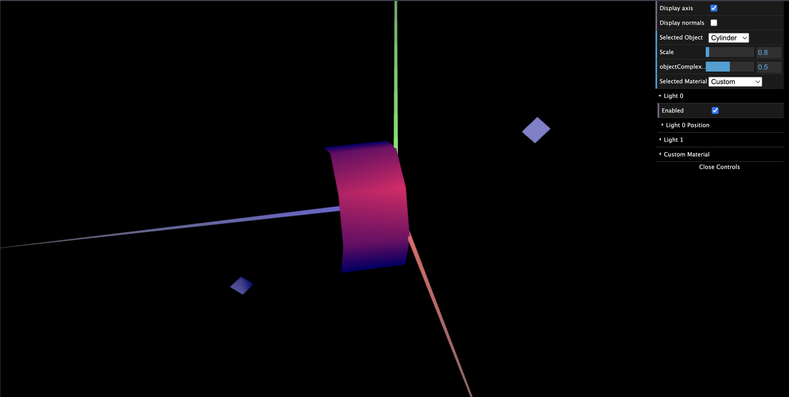

# CG 2023/2024

## Group T05G05

## TP 3 Notes

-
-

### Part 1 - Ilumination and Materials of Tangram

### Part 2 - Drawing a prism

### Part 3 - Cylindrical Surface - Application of Gouraud shading

