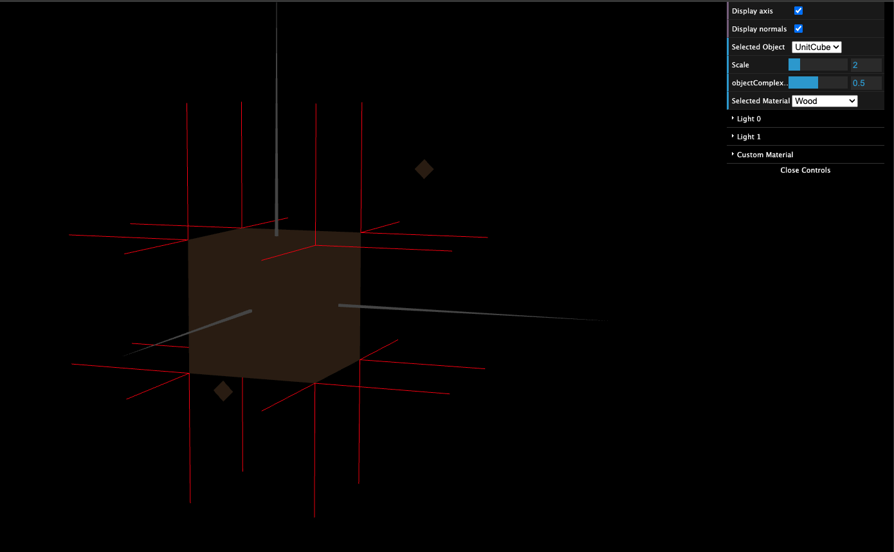
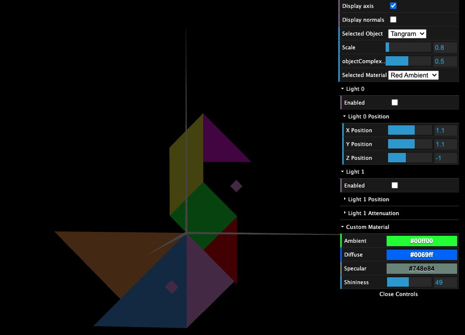

# CG 2023/2024

## Group T05G05

## TP 3 Notes

<<<<<<< HEAD
-
-

### Part 1 - Ilumination and Materials of Tangram

### Part 2 - Drawing a prism

### Part 3 - Cylindrical Surface - Application of Gouraud shading

=======
- On the first exercise we implemented the normals and applied colors to the objects.
- On the second exercise we created a prism.
- On the third exercise we created a cylinder, we also conclude that increasing the slices make the cylinder edges smoother.

### Exercise 1 - Ilumination and Tangram materials

**MyUnitCube**

**MyTangram**

### Exercise 2 - Drawing a prism

**MyPrism**

### Exercise 3 - Cylindrical Surface - Application of Gouraud shading

**MyCylinder**

>>>>>>> master
