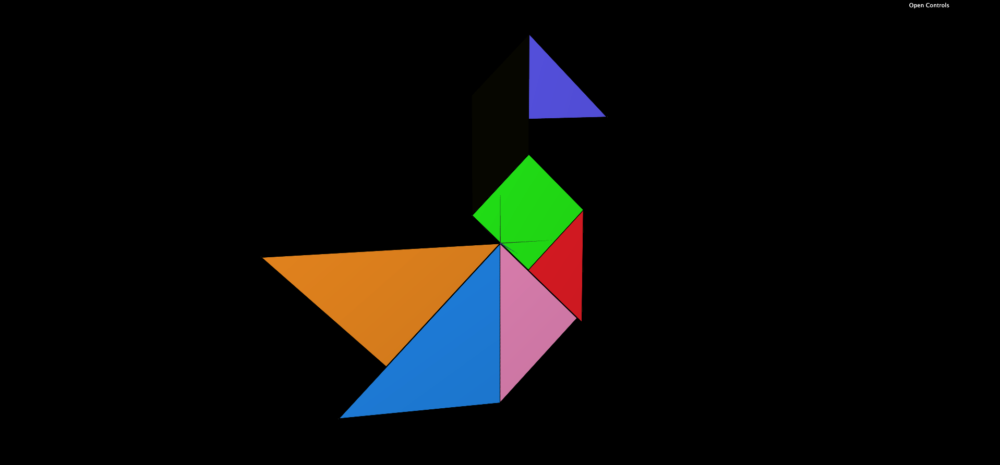
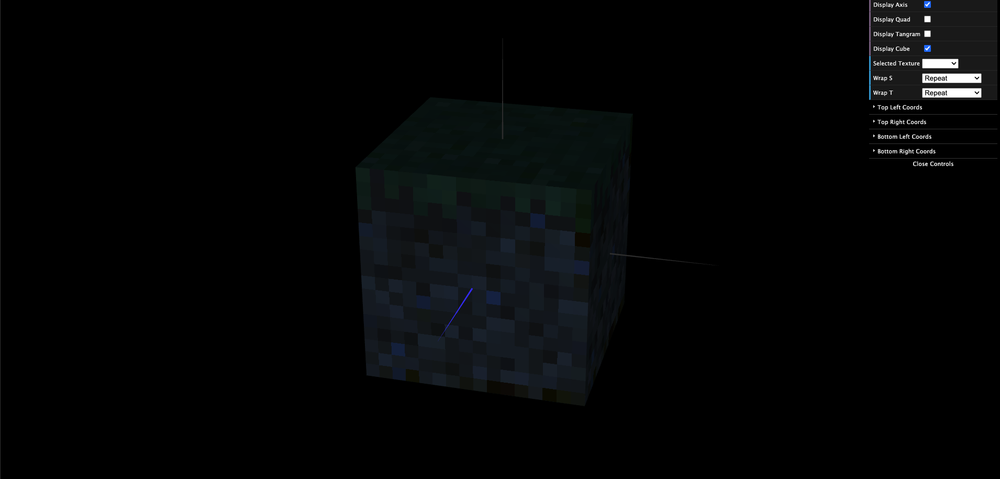

# CG 2023/2024

## Group T05G05

## TP 4 Notes

- On the first exercise we applied textures to the tangram.
- On the second we applied textures on all faces of a cube. It looks like a cube from minecraft :))

### Exercise 1 - Applying textures to Tangram

### Exercise 2 - Applying textures to a cube composed of planes

